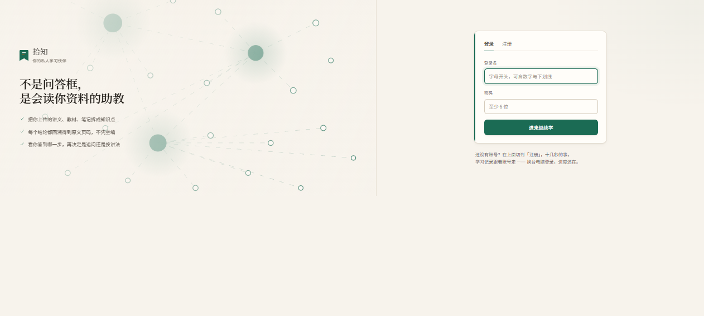
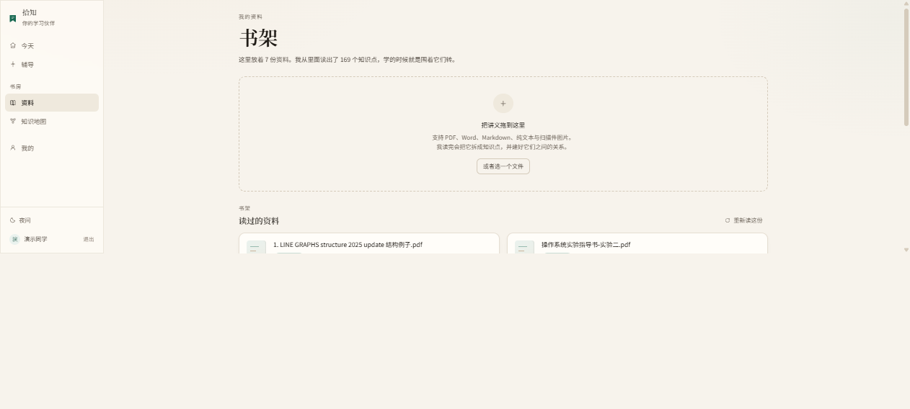
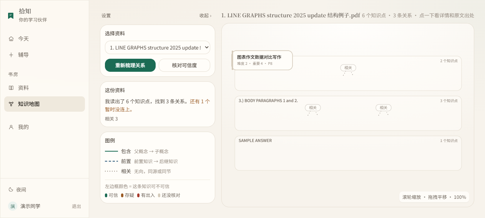
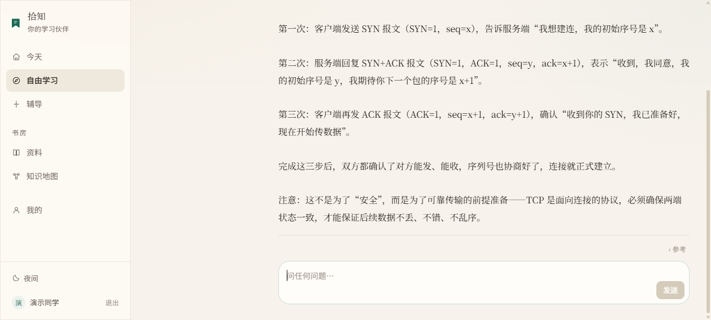
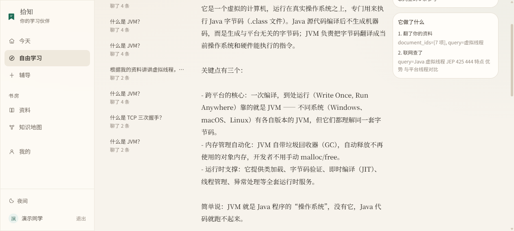

<div align="center">

# Shizhi — AI Learning Agent

**拾知 · AI 学习智能体**

<br/>

**不是问答框，是会读你资料的助教。**

上传讲义、教材、笔记 → 拆成知识点 → 建起知识体系
→ 检索、核实、看图 → **由 Agent 自己决定下一步**，陪你学到掌握为止

<br/>

[](https://www.python.org/)
[](https://fastapi.tiangolo.com/)
[](https://react.dev/)
[](https://modelcontextprotocol.io/)

</div>

<div align="center">

</div>

---

## 一、它是什么

**Shizhi（拾知）是面向个人学习场景的 AI 学习智能体。**

你把讲义、教材、笔记交给它，它把这门课变成一个**有结构、可溯源、可检验的知识体系**：

- **理解资料** —— 解析 PDF / DOCX / PPTX / TXT / MD / 图片，切成带页码的语义块并抽取知识点
- **建立体系** —— 知识点连成图谱（包含 / 前置 / 相关），标注每条的构建依据与可信度
- **RAG 检索** —— 向量检索你的资料，答案带页码回链，可一键跳回原文
- **联网核实** —— 只对"会随时间变化"的信息联网，并如实报告用了哪条通道
- **多模态分析** —— 上传截图、题目照片、代码片段，由视觉模型读取
- **交互式教学** —— 由 Tutor Agent 判断你答得怎么样，再决定下一步怎么教

而"上面这些**什么时候用、要不要用、什么时候停**" ——
由一个 **Agent Loop** 自己决定。这是它和"能调工具的聊天机器人"的分界线（**见第五节**）。

---

## 二、它解决什么问题

**通用聊天机器人对"你的资料"一无所知。**
你把课程讲义丢给 ChatGPT，它要么读不了 PDF，要么凭自己的印象讲一套和你老师不一样的体系。
考试考的是你老师那套，通用模型的"标准答案"反而添乱。

**模型不知道自己的边界在哪。**
它会把"记不清的最新情况"和"有把握的经典定义"用同一种确定的语气讲出来。
学生没有能力分辨哪句可信 —— 这是最危险的部分。

**回答不可溯源。**
"进程和线程的区别"它答得头头是道，但你无法确认这和你第 4 页讲义说的是不是一回事。

**它不知道自己"现在几号"。**
实测问「今天几号」，模型凭记忆答了 **2024 年 6 月 13 日** ——
实际是 2026 年 9 月 20 日，**差了两年多，而且答得非常自信**。
用户没有理由怀疑，除非他自己知道今天几号（那他就不会问了）。

**Shizhi 的设计取向由此确定**：

- **引用有优先级**：你的资料 > 联网证据 > 模型通识。用通识必须显式标注"不在你的资料中"
- **资料里没有就说没有**：检索结果全部不相关时**直接短路、不调用模型**，而不是硬编一个答案
- **任何"实时"的东西都去查真实来源**，不靠模型记忆
- **能证明的才敢说**：结论回溯得到原文页码或网页链接

---

## 三、核心体验

> 首页那张是登录页 —— 产品定位就写在界面上。

### 3.1 把资料丢进书架，它就开始读

<div align="center">

</div>

### 3.2 知识点连成体系，每条都标可信度

<div align="center">

</div>

### 3.3 自由学习：问什么都可以，它自己决定怎么做

<div align="center">

</div>

### 3.4 而且你**看得见**它做了什么

右侧面板实时显示这一轮 Agent 的每一步：**先翻了你的资料，再联网查了** ——
不是"黑箱给个答案"，而是可审计的决策链。

<div align="center">

</div>

---

## 四、核心能力

### ① 自由学习空间
开放入口，问什么都可以。多轮对话、SSE 流式、附件上传。
**由 Agent 自己决定这一轮要用哪些能力** —— 用户不选"用 RAG 还是联网"。

### ② 资料理解
PDF / DOCX / PPTX / TXT / MD / 图片，单文件上限 300MB，流式落盘。
解析后切成**带页码**的语义块，再由模型抽取知识点、构建章节层级。

> 页码**绝不由模型输出** —— 模型只给块序号，页码由代码反查回填。模型报页码会编。

### ③ 知识体系与可信度
知识点连成图谱（包含 / 前置 / 相关），三级校验分开存放而非合并成一个分数：

| 层 | 手段 | 成本 |
|---|---|---|
| L1 规则 | 格式、长度、明显异常 | 零 |
| L2 模型自评 | 判断这个知识点是否可疑 | 一次调用 |
| L3 联网核验 | 只对**可疑**的联网查证 | 有搜索配额成本 |

> 刻意**不产出"过时"状态** —— 比对手段不足时，宁可少下结论。

### ④ RAG 检索
Chroma 向量检索 + **距离门槛**。低于门槛的片段直接被丢弃，
并在响应里带回丢弃原因；**上下文为空时短路，不调用模型**，
直接返回「这部分不在你的资料中」。

> 这是 RAG 与"套壳 ChatGPT"的分界线：资料里没有的，宁可说没有，也不要编。

### ⑤ 联网核实
经 **MCP** 调用 Tavily 官方 Server（远程 HTTP）。
只对"会随时间变化"的信息使用 —— 经典概念不联网，省配额也省等待。

### ⑥ 多模态
上传截图 / 题目照片 / 代码片段，由**独立的视觉模型**读取（与主模型分离，控制成本）。
支持粘贴、拖拽、点选三种入口。

> 视觉能力**按部署显式声明**。未开启时系统如实告诉用户"这条看不了"，
> 而不是猜图里有什么。

### ⑦ Tutor Agent 教学循环
面向"我辅导你这门课"的场景。**六种教学动作，一轮只选一个**：
追问 / 讲解 / 换讲法 / 升难度 / 降难度 / 总结。
阈值硬约束在状态机里：连对 2 次升难度、连错 2 次换讲法、连错 3 次回退前置知识点。

---

## 五、为什么它是 Agent

**区别不在"能调工具"，而在"自己决定调不调、以及什么时候停"。**

<div align="center">

```
                    ┌─────────────────────────────────────┐
                    │                                     │
                    ▼                                     │
              OBSERVE ──▶ DECIDE ──┬─ 要调工具 ──▶ EXECUTE ─┤
                                   │                  │   │
                                   │                  ▼   │
                                   │          OBSERVE RESULT
                                   │                      │
                                   └─ 信息够了 ──▶ FINAL ANSWER
```

</div>

**关键在这三点：**

**1. 决策是模型做的，不是代码写死的。**
没有 `if 提到文件就检索`、`if 有版本号就联网` 这类路由。
模型看到"当前可用工具 + 已拿到的结果"，自己决定下一步。

**2. 每一步之后会重新判断。**
`retrieve_knowledge` 的结果不够回答时，它会**继续调 `web_search`** ——
而不是按预设顺序跑完流水线。

**3. 什么时候停，也是它决定的。**
它需要判断"资料已经够了，可以回答了" —— 而不是调满所有工具。

### 它有哪些可调用的能力

| 工具 | 用途 | 计入调用配额 |
|---|---|---|
| `retrieve_knowledge` | 在用户自己的资料里检索 | ✅ |
| `web_search` | 联网搜索（MCP 或 Tavily REST） | ✅ |
| `document_analysis` | 在指定的某一份资料里找内容 | ✅ |
| `image_analysis` | 看图（需支持视觉的模型） | ✅ |
| `current_time` | 当前日期时间 | ❌ 本地读，不占配额 |

> **给模型的清单里只会有"当下真的能用"的工具** ——
> 联网没配 Key 时 `web_search` 不出现；模型不支持视觉时 `image_analysis` 不出现。
> 让它看见一个调不通的工具，只会浪费一次决策。

### 但不能失控：四条硬限制

| 限制 | 默认 | 少了它会怎样 |
|---|---|---|
| `MAX_STEPS` | 6 | 模型可以反复"不调工具也不回答"，空转 |
| `MAX_TOOL_CALLS` | 3 | 一步里并发调多个工具，成本失控 |
| `TOTAL_TIMEOUT` | 30s | 每次调用都快但次数多，用户干等 |
| 同一工具重试上限 | 2 | 反复撞同一堵墙 |

**超限不是报错，而是降级到最终回答** ——
拿已有信息回答并说明"还有一步没做完"，比抛一个超时错误有用得多。

> ⚠️ `TOTAL_TIMEOUT` **只约束工具编排**，不约束最终生成（生成就是降级目标本身）。
> 所以 30s 应理解为"愿意在工具编排上花多久"，用户实际等待 ≈ 编排 + 生成。

### 还有一条快通道

没提资料、没有时效信号、无附件的问题（如"什么是 JVM"）**不进循环**，直接生成 ——
保住"简单问题一次 LLM 调用"。

> 要不要花一次决策是**成本决策，不该由模型来定**。

---

## 六、技术架构

```
┌──────────────────────────────────────────────────────────────────┐
│  前端  React 18 + TypeScript + Vite + TailwindCSS                │
│  今天 · 自由学习 · 辅导 · 资料 · 知识地图 · 我的                    │
└────────────────────────────┬─────────────────────────────────────┘
                             │ REST + SSE
┌────────────────────────────▼─────────────────────────────────────┐
│  后端  FastAPI + Pydantic v2 + SQLAlchemy 2.0 + Alembic           │
│                                                                  │
│  ┌────────────────── Agent 层（自研轻量 Runtime）──────────────┐   │
│  │  Agent Loop（自由学习）      Tutor 状态机（辅导）            │   │
│  │  Tool Registry · ToolBudget · 提示词模板                    │   │
│  └───────┬──────────────────────┬─────────────────────────────┘   │
│          │                      │                                 │
│  ┌───────▼────────┐  ┌──────────▼─────────┐  ┌────────────────┐  │
│  │ RAG            │  │ 联网               │  │ 解析与抽取      │  │
│  │ Chroma + 门槛  │  │ MCP ⇄ Tavily REST  │  │ PDF/DOCX/PPTX  │  │
│  └───────┬────────┘  └──────────┬─────────┘  └────────┬───────┘  │
└──────────┼──────────────────────┼─────────────────────┼──────────┘
           ▼                      ▼                     ▼
      Chroma（本地）         Tavily MCP Server      本机文件
           │
           ▼
      MySQL 9.6 · 资料 / 知识点 / 关系 / 校验 / 会话 / 学习状态
```

**技术栈**

| 层 | 选型 |
|---|---|
| 前端 | React 18 + TypeScript + Vite + TailwindCSS |
| 后端 | Python 3.13 + FastAPI + Pydantic v2 |
| 数据库 | MySQL 9.6 + SQLAlchemy 2.0 + Alembic |
| 向量库 | Chroma（embedded，进程内，无需独立服务） |
| LLM | OpenAI 兼容网关（通义千问 / DeepSeek / 智谱 / OpenAI 均可切换） |
| Agent | **自研轻量 Runtime**（状态机 + JSON 结构化工具调用），不用 LangGraph |
| 联网 | MCP（Tavily 官方 Server，远程 HTTP）/ Tavily REST 双通道 |
| 解析 | PyMuPDF / python-docx / python-pptx / 多模态 LLM |

**明确不引入**：Multi-Agent、复杂微服务、消息队列、K8s、图数据库。

---

## 七、核心工程设计

挑五个**最值得看**的设计。详细来龙去脉见 [`docs/30-工程细节与运维备忘.md`](docs/30-工程细节与运维备忘.md)。

### 7.1 Agent Runtime：两套循环并存，而不是合并

自由学习用 **Agent Loop**（可循环决策）；辅导用 **Tutor 状态机**（九态线性流水线，
`DECIDE_ACTION` 一轮只执行一次）。

**为什么不合一**：教学动作一轮只能选一个，这是硬约束 —— 一次性决策是对的。
把工具编排塞进同一个状态机，会让**教学策略**和**工具编排**互相牵制：
下次改教学阈值时得先想清楚会不会影响工具循环。

两者共用底层的 `ToolRunner` / `ToolBudget`。

### 7.2 Tool Registry：按名字查表，而不是调用方传函数

模型说"我要用 `web_search`"，代码去注册表里查实现 ——
而不是在每个调用点写 `if name == "...":`。

工具是**声明式的**（名字 / Schema / 可用性 / 执行函数），
所以"加一个工具"的成本是"写一个 handler + 注册一次"，不需要动 Agent 主流程。

**`ToolResult.content` 是文本而不是结构化 JSON** ——
模型读结构化 JSON 时容易把字段名当内容讲出来。

### 7.3 MCP：工具名必须运行时动态发现

联网走 Tavily 官方 MCP Server（远程 HTTP）：

```
initialize → serverInfo {"name":"tavily-mcp","version":"4.0.4"}
tools/list → 5 个工具
tools/call → tavily_search(...)
```

**工具名不硬编码。** 这不是洁癖 —— 实测踩过：

| | 工具名 |
|---|---|
| 官方 README / 各 MCP 目录站 | `tavily-search`（**连字符**） |
| `tools/list` **实际返回** | `tavily_search`（**下划线**） |

照文档硬编码会**静默不工作**，报错是一句难懂的 "tool not found"。

**三种后端模式**，以及一条刻意的回退规则：

| 情况 | 行为 |
|---|---|
| MCP 运行时故障（连不上 / 401 / 超时） | 回退 Tavily REST，**并上报回退原因** |
| MCP 连上了但**能力清单里没有搜索工具** | ⚠️ **不回退** —— 这是配置错误，不是网络问题 |

静默回退会把"工具名对不上"永远掩盖成"网络偶尔不好"：
你会一直以为 MCP 在工作，直到某天备用通道也不可用。

**回退必须在界面上看得见** —— 每条引用带实际用了哪条通道、有没有回退、为什么。

### 7.4 RAG 的可信边界：距离门槛 + 空上下文短路

`Top-K` 永远返回 K 条 —— 没有门槛就会拿无关片段硬编答案。

所以检索结果会经过**余弦距离门槛**筛选：

- 低于门槛 → 丢弃，**并在响应里带回丢弃原因**（不是静默过滤）
- 全部低于门槛 → **直接短路，不调用模型**，返回「这部分不在你的资料中」

门槛值 `0.40` 是**实测校准**的（资料内问题 0.145~0.286，资料外 0.415~0.577），
换 embedding 模型后必须重新校准。

### 7.5 Tutor Policy：阈值写在状态机里，不交给模型

"连对 2 次升难度、连错 2 次换讲法、连错 3 次回退前置知识点" ——
**这些是代码里的硬约束，不是提示词里的建议。**

模型负责"在规则允许的范围内选一个动作"，不负责决定规则本身。

---

## 八、项目结构

```
.
├─ apps/
│  ├─ api/                          # 后端 FastAPI
│  │  ├─ app/
│  │  │  ├─ api/routes/             # health / chat / documents / knowledge
│  │  │  │                          #   / rag / tutor / study / auth
│  │  │  ├─ core/                   # 配置中心、LLM 网关（含多模态）
│  │  │  ├─ agent/                  # Agent 运行时
│  │  │  │  ├─ runtime.py           #   Tutor 状态机
│  │  │  │  ├─ runtime_loop.py      #   Agent Loop
│  │  │  │  ├─ policy.py            #   教学动作决策与阈值
│  │  │  │  ├─ tool_specs.py        #   五个 Tool 的包装与注册
│  │  │  │  ├─ tools/               #   ToolSpec / ToolRegistry / ToolRunner
│  │  │  │  └─ prompts/             #   提示词模板
│  │  │  ├─ ingestion/              # 解析、分块、存储
│  │  │  ├─ search/                 # MCP 客户端 + Provider 路由与回退
│  │  │  ├─ rag/                    # 向量库封装、embedding provider
│  │  │  ├─ services/               # 业务逻辑
│  │  │  └─ models/  schemas/  db/
│  │  ├─ alembic/                   # 迁移（9 个版本）
│  │  └─ tests/                     # 34 个测试文件
│  └─ web/                          # 前端 React + Vite
│     └─ src/
│        ├─ api/                    # 接口封装（含 SSE 解析，纯逻辑可单测）
│        ├─ features/               # today / study / learn / chat / library
│        │                          #   / graph / knowledge / profile / auth
│        ├─ app/  ui/  components/  lib/  motion/
├─ skills/                          # Skill 包（与代码解耦的决策策略文档）
├─ docs/                            # 方案 / 验收 / 工程备忘（30 份）
├─ scripts/                         # 建库、冒烟、校准、端到端验证
├─ samples/                         # 演示资料
├─ data/                            # 运行时数据（.gitignore）
└─ .env.example
```

---

## 九、快速启动

### 1. 环境要求

| 依赖 | 版本 |
|---|---|
| Python | ≥ 3.11 |
| Node.js | ≥ 20 |
| MySQL | ≥ 8.0 |

> Chroma 随 pip 依赖安装，**不需要单独启动服务**。

### 2. 准备数据库

```bash
mysql -u root -p -e "CREATE DATABASE IF NOT EXISTS learning_buddy DEFAULT CHARSET utf8mb4;"
```

### 3. 安装后端

```bash
python -m venv .venv
source .venv/Scripts/activate        # Windows Git Bash
# source .venv/bin/activate          # macOS / Linux
pip install -r apps/api/requirements.txt
```

### 4. 配置环境变量

```bash
cp .env.example .env
```

编辑 `.env`，**至少确认这几项**：

```ini
MYSQL_PASSWORD=你的MySQL口令

# 对话与工具调用必需。留空则进入 mock 模式（仍可跑通整条链路，零 API 消耗）
LLM_API_KEY=
LLM_BASE_URL=https://dashscope.aliyuncs.com/compatible-mode/v1
LLM_MODEL=qwen-plus

# RAG 检索必需。留空则索引与问答接口明确返回 409，不静默降级
EMBEDDING_API_KEY=

# 联网搜索必需（MCP 与 Tavily REST 共用同一个 Key）
TAVILY_API_KEY=
```

> ⚠️ `LLM_BASE_URL` 与 `LLM_MODEL` **必须配套** —— 换了端点要同时换模型名。

### 5. 建库与迁移

```bash
python scripts/init_db.py
```

### 6. 启动后端

```bash
cd apps/api
python -m uvicorn app.main:app --reload --port 8000
```

- 接口文档：<http://127.0.0.1:8000/docs>
- 健康检查：<http://127.0.0.1:8000/api/health>（LLM / MySQL / Chroma / Embedding 四组件）

### 7. 启动前端

```bash
cd apps/web
npm install
npm run dev
```

打开 <http://localhost:5173>

### 8. 自检

```bash
python scripts/smoke_test.py        # 配置 / LLM / MySQL / Chroma 全组件
python scripts/scan_secrets.py      # 凭据泄漏扫描
```

**完整环境变量清单**（6 个分组）见 [`docs/30`](docs/30-工程细节与运维备忘.md#一完整环境变量清单)
或 `.env.example`。

---

## 十、测试与验证

### 命令

```bash
# 后端
cd apps/api && pytest -q                    # 全量
cd apps/api && pytest tests/agent -q        # 只跑 Agent 相关

# 前端
cd apps/web && npm run typecheck            # 类型检查
cd apps/web && npm run test:unit            # 单测（Node 内置 test runner）
cd apps/web && npm run build                # typecheck + 生产构建

# 端到端
python scripts/verify_stage2_api.py         # 登录门 + 三个 Agent 场景（真打 HTTP/SSE）
python scripts/verify_stage22_upload.py     # 上传 + 看图（真打 HTTP）
python scripts/verify_stage2_browser.py     # 浏览器端（需前后端已启动）
python scripts/smoke_test.py                # 全组件冒烟
```

### 已验证的能力

| 项 | 状态 |
|---|---|
| 后端测试 | 34 个测试文件 / 598 个用例，退出码 0 |
| 前端测试 | 55 个用例、typecheck、生产构建全过 |
| 接口路径 | 46 个 |
| **场景 A**：普通问题 | 0 工具调用、1 次 LLM 调用 |
| **场景 B**：资料不足再联网 | `retrieve_knowledge → web_search → 收尾`，**循环可见** |
| **场景 C**：传图 → 看图 → 回答 | 回答含图内标识符 |
| MCP | `initialize` / `tools/list` / `tools/call` 协议链验证通过 |
| MCP 负向测试 | `mcp` 模式 + 错误 Key → **明确失败且不回退** |
| 浏览器验收 | 三个 Agent 场景 + 通道标识 + 无内部术语泄漏 + 无控制台错误 |

> **mock 模式的价值**：`chat_json()` 在 mock 下返回由输入派生的合法 JSON，
> 整条流水线可以**离线回归、零 API 消耗**。日常改动与 CI 都跑 mock，只有验收时才打真实模型。

---

## 十一、当前限制与路线

### 11.1 已知产品限制

这些是**当前版本的限制**，不是缺陷 —— 日常使用会遇到，但不影响核心流程。

| 限制 | 说明 |
|---|---|
| **前端没有修改密码入口** | 后端 `POST /api/auth/password` 已实现（含旧密码校验），但界面上暂无入口，待补充密码管理界面 |
| 自由学习不保存学习进度 | "学到哪了"属于**阶段 3** 的知识保存与复杂 Memory，当前不记录 |
| 附件只能删除 | 不支持重命名；多附件排序规则尚未确定 |
| 对话附件与正式资料未区分 | 上传的图片会**同时进入书架与检索范围** —— 这是当前的设计选择（一致性优先）；若后续需要区分，要增加标记字段 |
| MCP 限流未知 | Tavily 文档提到 `tavily_research` 为 20 req/min，但 **`tavily_search` 的实际限流尚未确认**，不做假设 |

### 11.2 工程债

这些是**已知的、有明确处理方向**的实现问题。

| 项 | 说明 |
|---|---|
| 右侧面板暴露实现细节 | "它做了什么"会显示 `document_ids=[7 项]` 这类技术信息，按产品设计应收进开发者面板 |
| 未使用原生 function calling | 当前走项目自己的 JSON 通道（各家支持程度不一，且会多一轮往返）。**若后续实测发现模型工具选择质量不足**，再作为独立阶段引入 —— Agent Loop 的结构不需要为此改动 |
| `docker-compose.yml` **未实测** | 只是备用方案，**本机没有 Docker，从未运行验证过**。请以本机 MySQL + pip 的启动步骤为准 |
| 无 `.gitattributes` | Windows 下 git 会提示 LF→CRLF，跨平台行尾未统一 |

### 11.3 后续阶段

| 阶段 | 内容 | 性质 |
|---|---|---|
| **阶段 3** | 知识保存与复杂 Memory —— 记录"学到哪了"、跨会话学习连续性 | **规划中**，不是 bug |
| **UI 优化（待排期）** | 见下 | 体验增强，非缺陷 |
| 原生 function calling | 视实测效果决定是否引入 | 可选 |

**UI 优化项**（已识别，**尚未实现**）：

1. 左上角掌握度环形进度增加 tooltip —— 说明"本知识点当前掌握进度 35%"，避免用户不知百分比含义
2. Agent 文本块适当分段 —— 将"复习回顾 / 知识点定义 / 核心考点"轻量分组；`abstract` 这类代码关键词使用代码样式
3. "现在的问题"使用浅底色问题框，与 Agent 讲解内容形成视觉区分
4. 输入区域提示文字保持简洁，可增加字数提示；有内容时提交按钮进入激活态
5. 用户提交答案后增加轻量状态提示（如"Agent 正在思考评价你的回答"），作为可选增强

### 11.4 环境注意事项

**`data/chroma` 只支持单写者。** SQLite 后端不支持多进程并发写 ——
两个进程同时访问同一目录会让检索间歇性失败，且报错很难联想到并发。

---

## 十二、License 与致谢

### License

**尚未选定。** 在添加许可证之前，他人默认**无权**使用、修改或分发本项目。

如果你打算开源，推荐 [`MIT`](https://choosealicense.com/licenses/mit/)（最宽松）或
[`Apache-2.0`](https://choosealicense.com/licenses/apache-2.0/)（含专利授权条款）。

### 致谢

本项目建立在这些开源项目之上：

- [FastAPI](https://fastapi.tiangolo.com/) · [Pydantic](https://docs.pydantic.dev/) · [SQLAlchemy](https://www.sqlalchemy.org/) · [Alembic](https://alembic.sqlalchemy.org/)
- [React](https://react.dev/) · [Vite](https://vitejs.dev/) · [TailwindCSS](https://tailwindcss.com/) · [Radix UI](https://www.radix-ui.com/)
- [Chroma](https://www.trychroma.com/) —— 向量检索
- [PyMuPDF](https://pymupdf.readthedocs.io/) · [python-docx](https://python-docx.readthedocs.io/) · [python-pptx](https://python-pptx.readthedocs.io/) —— 文档解析
- [Model Context Protocol](https://modelcontextprotocol.io/) · [Tavily](https://tavily.com/) —— 联网检索

---

<div align="center">

**更详细的技术内容**：[`docs/30-工程细节与运维备忘.md`](docs/30-工程细节与运维备忘.md)
· 方案与验收记录：[`docs/`](docs/)

</div>
