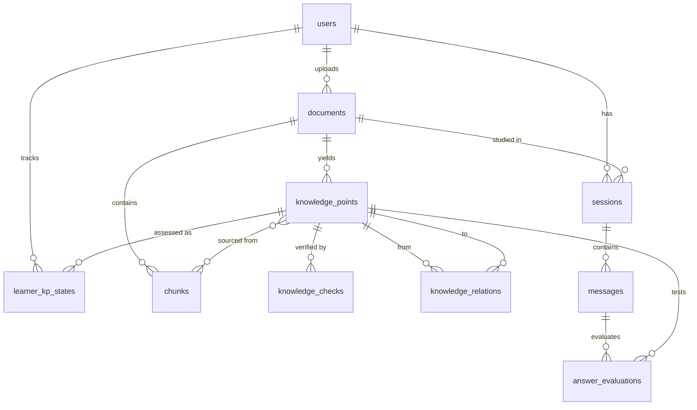

# Learning Buddy · 多模态学习智能体 技术方案 v1.0

> 面向大学生学习场景的多模态学习智能体
> 状态：**待评审**（本文档不含代码，仅含分析、架构与开发计划）
> 明确排除：MCP、多 Agent、复杂微服务

---

## 0. 一句话定位

**Learning Buddy 不是"能聊天的搜索框"，而是"能读懂你的资料、验证你的知识、并主动带着你学会的私人助教"。**

四个动词定义了它：**读懂（解析）→ 结构化（抽取）→ 核实（校验）→ 带练（辅导）**。

---

## 一、核心用户价值：Learning Buddy 与普通 AI Chatbot 的本质区别

### 1.1 五个维度的差异

| 维度 | 普通 AI Chatbot | Learning Buddy |
|---|---|---|
| **知识来源** | 模型参数内的通识，与用户无关 | 用户自己上传的教材 / PPT / 论文 / 笔记（原文可溯源） |
| **可信度** | 无法核验，可能一本正经地幻觉 | 每个知识点带置信度与核验状态，可疑内容**主动联网查证**并给出证据链接 |
| **知识形态** | 一次性的线性对话文本 | 持久化的**结构化知识图谱**（前置/包含/相关/对比） |
| **交互方向** | 用户问 → 模型答（被动响应） | Tutor Agent **主动提问、追问、换讲法、调难度**（主动引导） |
| **记忆** | 会话结束即遗忘 | 学习者画像 + 知识点掌握度**跨会话累积** |
| **输出** | 一段答案 | 掌握度地图 + 薄弱点清单 + 下一步学习建议 |

### 1.2 用户的真实痛点（为什么这个项目值得做）

一个大学生的真实学习路径是：**老师给的 200 页 PDF / 一堆 PPT / 自己拍的书页照片** → 靠自己划重点 → 考前不知道自己哪里不会 → 问 AI 又不知道它答得对不对。

三个致命痛点：

1. **"资料太多，我不知道重点是什么"** —— 缺少结构化，知识是散的。
2. **"AI 说的我不确定对不对"** —— 教材版本陈旧、AI 幻觉，学习者没有鉴别能力。
3. **"我以为我会了，其实我不会"** —— 缺少被追问、被检验的环节，学习是"假性掌握"。

### 1.3 核心价值主张

- **把"一堆文件"变成"一张知识地图"** —— 上传即可用，零整理成本。
- **把"不可信的回答"变成"可追溯、可核验的知识"** —— 每条结论都能点回原文或外部证据。
- **把"我问它答"变成"它带着我学"** —— 苏格拉底式追问，答错换讲法，答对升难度。
- **把"一次性对话"变成"持续累积的学习状态"** —— 下次打开，它记得你哪里弱。

---

## 二、整体技术架构

### 2.1 分层职责

| 层 | 技术选型 | 职责（做什么） | 明确不做什么 |
|---|---|---|---|
| **前端 Web** | React 18 + TypeScript + Vite + TailwindCSS | 上传与进度、知识点/图谱展示、核验证据展示、辅导对话 UI、掌握度面板 | 不持有业务规则；不做 LLM 直连 |
| **后端 API** | Python 3.11 + FastAPI + Pydantic v2 | 鉴权、文件接收、任务编排入口、SSE 流式下发、DTO 校验 | 不写 prompt 细节；不直接操作向量库细节 |
| **Agent 编排层** | **自研轻量 Runtime**（状态机 + LLM Function Calling） | 决定"下一步做什么"：调哪个 Tool、是否联网、用什么教学动作 | 不做文件解析、不做向量计算 |
| **LLM 网关** | OpenAI 兼容协议（DeepSeek / Qwen / GLM 可切换） | 文本生成、结构化抽取、答案评分、多模态图理解 | 不管存储；不保存会话 |
| **RAG 层** | bge-m3 向量 + Chroma + bge-reranker | 分块、向量化、混合检索、重排、引用回链 | 不做业务判断 |
| **文件解析层** | PyMuPDF / python-docx / python-pptx / RapidOCR / 多模态 LLM | 把任意文件变成带页码的结构化文本块 | 不做知识点判断 |
| **向量数据库** | Chroma（本地持久化） | 存 chunk 向量与 KP 检索卡，支持元数据过滤 | 不存业务主数据 |
| **MySQL 8** | SQLAlchemy 2.0 + Alembic | 用户、文档、知识点、关系、消息、评估、掌握度等**事实数据** | 不存大文本向量 |
| **Web Search Tool** | Tavily / Serper / Bing API + trafilatura 正文抽取 | 对可疑知识点做外部核验，返回证据（标题/URL/摘要/时间） | 不做通用闲聊搜索 |
| **Memory** | 双层：会话短期记忆（DB + 上下文窗口）+ 学习者长期记忆（画像 + 掌握度） | 让 Agent "记得住" | 不是向量库的替代品 |

### 2.2 通信关系

- **前端 ↔ 后端**：REST（JSON）+ **SSE**（LLM 流式、解析进度）。不用 WebSocket——单向流足够且更简单。
- **后端 ↔ LLM**：HTTP（OpenAI 兼容 `/chat/completions`，`stream=true`）。
- **后端 ↔ MySQL**：SQLAlchemy 连接池。
- **后端 ↔ Chroma**：进程内 embedded client（零运维），后续可无缝换 server 模式。
- **后端 ↔ Web Search**：HTTP 调用第三方搜索 API，**必须加超时 + 缓存 + 失败降级**。

### 2.3 关键调用时序（辅导一次对话）

```
前端 SSE 请求
  └─> API 路由 → Tutor Agent Runtime
        ├─ 1. 读 Memory（会话上下文 + 该用户该知识点的掌握度）
        ├─ 2. 调 retrieve_knowledge（RAG：向量+关键词混合 → rerank）
        ├─ 3. 加载 socratic-tutoring Skill（教学策略库）
        ├─ 4. LLM 决策：本轮教学动作 = {追问 | 讲解 | 换讲法 | 升难度 | 降难度}
        ├─ 5. 若动作为"讲解"且检索命中不足 → 触发 web_search 补证
        ├─ 6. 流式生成回复 → SSE 增量下发（带 action_type 元数据）
        └─ 7. 若本轮是"提问"，等待用户作答 → evaluate_answer → update_learning_state
```

> **为什么要自研 Agent Runtime 而不直接上 LangGraph/LlamaIndex Agent？**
> 本项目要"体现明确的 Agent 特征"，评审看的就是**决策过程的可解释性**。自研一个 300 行左右的状态机 + Tool Registry，每一步决策（为什么调这个 Tool、为什么换讲法）都能落库、能在前端展示，比框架黑盒更有说服力。框架的收益主要在工程便利性，而本项目的重点在"Agent 味道"。解析/分块这类确定性工作用普通函数 + 现成库即可，不需要编排框架。

---

## 三、Agent 核心 Workflow

整体分为**两条 Workflow + 一个 Agent Loop**：前两条是确定性流水线（可重跑、可观测），第三条才是 Agent 自主决策区。

### 3.1 Workflow A · 资料摄取与知识构建（确定性）

| 步骤 | 输入 → 输出 | 关键决策点 |
|---|---|---|
| ① 上传 | 文件 → 存储路径 + `documents` 记录 | 类型/大小校验，去重（文件 hash） |
| ② 解析 | 文件 → 结构化块（带页码/坐标） | **按类型路由**：PDF 走文本层，扫描件走 OCR，图片/图表走多模态 LLM |
| ③ 清洗与分块 | 块 → chunks（语义分块 + 重叠） | 表格/公式不切断；保留标题层级 |
| ④ 知识点抽取 | chunks → KP 列表（标题/摘要/要点/难度/来源） | LLM 结构化输出 + Schema 校验 + **去重合并** |
| ⑤ 关系构建 | KP 列表 → 知识图谱边 | 同文档内建立前置/包含/相关/对比关系 |
| ⑥ 可信度校验 | KP → 置信度 + 核验状态 | 见 3.2 |
| ⑦ 索引 | chunks + KP 卡片 → 向量库 | 双路索引：原文 chunk 用于引用，KP 卡片用于概念检索 |

### 3.2 Workflow B · 可信度校验与联网核验（半自主）

**三级校验，逐级升级，避免无意义地烧搜索配额：**

| 级别 | 手段 | 判定 | 成本 |
|---|---|---|---|
| L1 规则 | 时间敏感词（"最新""2023年"）、内部数字矛盾、单位缺失、来源缺失 | 命中即标 `suspect` | 0 |
| L2 模型自评 | 让 LLM 输出 confidence(0~1) + 存疑理由 | `< 0.7` 标 `suspect` | 低 |
| L3 联网核验 | **仅对 suspect / outdated 的 KP** 触发 | 见下方判定 | 高 |

**是否联网的判定规则（Agent 自主决策的体现）：**

```
if 判定为常识性、稳定学科知识（如"牛顿第二定律"） → 不联网，标记 trusted
elif KP 含时间/版本/政策/价格/排名/临床指南类特征 → 联网核验（强需求）
elif KP 为文档内部推导结论 → 不联网，交给文档内引用溯源
elif 用户手动点击"核验这条" → 联网核验（人工触发）
```

**联网核验流程**：生成检索查询 → `web_search` 取 Top-5 → `fetch_url` 抽正文 → LLM 对比裁决 → 输出四种结论之一：`confirmed`（支持） / `outdated`（已过时，给出新信息） / `conflict`（存在冲突，双方证据并列） / `unverifiable`（无可靠证据）。结论 + 证据 URL + 时间写入 `knowledge_checks` 表，前端以徽章 + 证据抽屉展示。

### 3.3 Agent Loop · Tutor 交互辅导（自主决策，项目核心）

```
用户作答 / 提问
   ↓
[1] 读状态：短期记忆（本轮上下文）+ 长期记忆（该 KP 掌握度、错误类型、学习风格）
   ↓
[2] RAG 检索：query 改写 → 混合检索 → rerank → Top-K（带 doc/page 引用）
   ↓
[3] 决策（LLM + 状态机约束）：本轮教学动作
   ├─ 追问 probe      ：答案正确但浅 → 往深挖一层
   ├─ 讲解 explain    ：答错且无基础 → 用资料原文讲
   ├─ 换讲法 rephrase ：同一知识连续答错 2 次 → 换类比/换例子/换粒度
   ├─ 升难度 harder   ：连续答对 2 次 → 提高难度或引入关联知识点
   ├─ 降难度 easier   ：连续答错 3 次 → 回退到前置知识点
   └─ 总结 summarize  ：本 KP 达掌握阈值 → 收口并给出复习建议
   ↓
[4] 执行动作：生成内容（可能触发 Tool：web_search 补证 / generate_question 出题）
   ↓
[5] 输出并落库（带 action_type，前端显式展示"当前教学动作"）
   ↓
[6] 用户作答 → evaluate_answer（score / 错误类型 / 反馈）
   ↓
[7] update_learning_state → 更新 mastery、连续正确/错误计数、下次复习时间
   ↓
回到 [1]（循环，直到本 KP 达标或用户退出）
```

**关键约束（防止 Agent 发疯）：**
- 每轮**只能选一个**主教学动作（避免"又讲又问又出题"的混乱输出）。
- 换讲法/升降难度有**触发阈值**（硬约束写在状态机里，LLM 只能在允许集合内选）。
- 引用优先级：用户资料 > 联网证据 > 模型通识；使用模型通识时必须显式标注"以下内容不在你的资料中"。
- 单轮 Tool 调用上限 3 次，总时长上限 30s，超时降级为纯讲解。

---

## 四、Skill / Tool / Workflow / Agent 的区分与清单

### 4.1 概念边界（先说清楚，避免混用）

| 概念 | 定义 | 谁触发 | 本项目的形态 |
|---|---|---|---|
| **Tool** | **原子能力**，有明确入参出参、幂等、无状态；由 LLM 通过 Function Calling 选择 | LLM 或代码 | Python 函数 + JSON Schema 注册表 |
| **Skill** | **可复用的能力包** = 提示词模板 + 领域知识 + 策略规则 +（可选）复合操作说明 | 被 Agent / Workflow 按需加载 | 一个目录一份 `SKILL.md` + prompt 模板文件 |
| **Workflow** | **确定性编排**，步骤固定、可重跑、可观测，无 LLM 自由决策 | 代码 / API 触发 | Ingest Pipeline、Verify Pipeline |
| **Agent** | **自主决策者**：观察 → 思考 → 选 Tool/Skill → 执行 → 再观察，循环至目标达成 | 用户消息触发 | Tutor Agent Runtime（受约束的 Loop） |

**一句话记忆**：Tool 是"手"，Skill 是"教材"，Workflow 是"流水线"，Agent 是"会看情况决定用哪只手翻哪本教材的人"。

### 4.2 第一版真正需要的 Tool（10 个，不多不少）

| # | Tool | 入参 → 出参 | 归属 | MVP |
|---|---|---|---|---|
| 1 | `parse_document` | 文件 → 结构化块（页/坐标/类型） | Workflow A | ✅ |
| 2 | `extract_knowledge_points` | chunk ids → KP 结构化列表 | Workflow A | ✅ |
| 3 | `build_knowledge_relations` | KP ids → 关系边列表 | Workflow A | ✅ |
| 4 | `verify_knowledge` | KP id + mode(rule/llm/web) → 判定 + 证据 | Workflow B | ✅ |
| 5 | `web_search` | query → 结果列表（标题/URL/摘要/时间） | **外部 Tool** | ✅ |
| 6 | `fetch_url` | URL → 正文 Markdown | 外部 Tool | ✅ |
| 7 | `retrieve_knowledge` | query + filters → 命中片段（带引用+分数） | RAG | ✅ |
| 8 | `generate_question` | KP + 难度 + 题型 → 题目 + 参考要点 | ~~Tutor Agent~~ | ✅ |
| 9 | `evaluate_answer` | 题目 + 用户答案 → 分数/等级/错误类型/反馈 | Tutor Agent | ✅ |
| 10 | `update_learning_state` | user + KP + 评估结果 → 更新掌握度/复习计划 | Tutor Agent | ✅ |
| 11 | `get_learner_state` | user + KP ids → 掌握度 + 薄弱点 + 画像 | Memory | ✅ |
| 12 | `generate_report` | session/user → 学习报告数据 | 报表 | ⏳ 后续 |

> 注：**教学动作决策（继续追问/换讲法/升难度）不做成 Tool**，它是 Agent 的**决策输出**，直接由 LLM 在受约束的动作集合中选择——做成 Tool 反而弱化了 Agent 特征。

### 4.3 第一版真正需要的 Skill（6 个）

| # | Skill | 内含什么 | 被谁使用 |
|---|---|---|---|
| S1 | `doc-ingestion` | 文件类型分派策略、扫描件/图表/公式处理规则、分块参数与禁忌 | Workflow A |
| S2 | `knowledge-extraction` | 抽取 JSON Schema、粒度规范（一个 KP 一个考点）、难度标注标准、去重合并判据 | Workflow A |
| S3 | `knowledge-verification` | **是否该联网的判定规则**、核验提问模板、四类裁决标准、证据可信度分级 | Workflow B |
| S4 | `socratic-tutoring` | 六种教学动作的定义与触发条件、讲解风格库（类比/公式/生活例子/图示）、提问设计法 | **Tutor Agent** |
| S5 | `answer-assessment` | 评分 rubric、错误类型学（概念混淆/记忆缺失/推导断裂/审题错误）、反馈话术 | Tutor Agent |
| S6 | `learning-report` | 报告结构与表述模板 | 阶段六 |

---

## 五、MVP 范围界定

### 5.1 必须做（不做就体现不出核心价值）

| 模块 | 必须包含 | 对应价值 |
|---|---|---|
| 资料接入 | PDF（文本层）、图片、TXT/MD 上传；单文档 | ① 读懂 |
| 解析 | 页级文本 + 图片走多模态理解；解析进度可见 | ① 读懂 |
| 知识提取 | KP 列表（标题/摘要/要点/难度/原文回链） | ② 结构化 |
| 知识结构 | 知识点关系图（可点击定位），不做复杂编辑器 | ② 结构化 |
| 可信度 | 三级校验 + **联网核验** + 证据展示 + 手动触发核验 | ③ 核实 |
| RAG | 用户资料库问答，**回答强制带引用** | ④ 带练 |
| Tutor Agent | 提问 → 评估 → **至少 3 种教学动作自动切换** | ④ 带练 |
| 学习状态 | 掌握度累计、薄弱点清单、跨会话记忆 | 持久化 |

### 5.2 可以后续增加（明确砍掉，防止第一版发散）

- 多文档知识库合并 / 跨文档知识融合
- 间隔重复自动推题（SM-2 完整版）、每日复习计划
- 学习报告导出 PDF / 分享链接
- 语音提问（ASR）、语音讲解（TTS）
- 知识点人工编辑、图谱拖拽整理
- 多用户/班级/教师视角、协作学习
- 扫描手写体 OCR 优化、复杂公式 LaTeX 渲染
- 错题本、知识卡片导出（Anki）
- 移动端专项适配、PWA

### 5.3 明确不做（第一版）

MCP 集成、多 Agent 协作、微服务拆分、消息队列、K8s、自训练模型、复杂权限体系（RBAC）。

---

## 六、项目目录结构

```
learning-buddy/
├─ apps/
│  ├─ web/                          # 前端 React + Vite + TS
│  │  ├─ src/
│  │  │  ├─ api/                    # 后端接口封装（含 SSE 客户端）
│  │  │  ├─ components/             # 通用 UI（徽章/抽屉/骨架屏/引用卡）
│  │  │  ├─ features/
│  │  │  │  ├─ upload/              # 上传 + 解析进度
│  │  │  │  ├─ knowledge/           # 知识点列表 + 关系图谱
│  │  │  │  ├─ verify/              # 核验徽章 + 证据抽屉
│  │  │  │  ├─ tutor/               # 辅导对话（含教学动作标签）
│  │  │  │  └─ dashboard/           # 掌握度与薄弱点
│  │  │  ├─ store/                  # 全局状态
│  │  │  └─ main.tsx
│  │  └─ vite.config.ts
│  └─ api/                          # 后端 FastAPI
│     ├─ app/
│     │  ├─ main.py                 # 应用入口、路由挂载、中间件
│     │  ├─ api/routes/             # documents / knowledge / sessions / verify
│     │  ├─ core/                   # config、llm 网关、日志、依赖注入
│     │  ├─ agent/                  # ★ Agent 运行时（项目灵魂）
│     │  │  ├─ runtime.py           # Agent Loop：观察→决策→调用→再决策
│     │  │  ├─ policy.py            # 教学动作状态机与阈值约束
│     │  │  ├─ tools/               # 每个 Tool 一个文件 + registry.py
│     │  │  ├─ workflows/           # ingest.py / verify.py（确定性流水线）
│     │  │  └─ prompts/             # 各 Skill 的提示词模板
│     │  ├─ rag/                    # chunking / embedder / retriever / vectorstore
│     │  ├─ ingestion/              # pdf / image / docx / txt / ocr / multimodal
│     │  ├─ search/                 # web_search 适配器 + 结果缓存 + 正文抽取
│     │  ├─ services/               # 业务逻辑（document / knowledge / tutor / state）
│     │  ├─ models/                 # SQLAlchemy ORM
│     │  ├─ schemas/                # Pydantic DTO
│     │  └─ db/                     # session / base / migrations(alembic)
│     └─ tests/
├─ skills/                          # ★ 可复用能力包（提示词+规则，与代码解耦）
│  ├─ doc-ingestion/SKILL.md
│  ├─ knowledge-extraction/SKILL.md
│  ├─ knowledge-verification/SKILL.md
│  ├─ socratic-tutoring/SKILL.md
│  ├─ answer-assessment/SKILL.md
│  └─ learning-report/SKILL.md
├─ data/                            # 运行时数据（.gitignore）
│  ├─ uploads/  chroma/  cache/  logs/  samples/
├─ docs/                            # 设计文档、API 约定、Demo 脚本、答辩材料
├─ scripts/                         # 初始化库、灌样例数据、批量导入
├─ docker-compose.yml               # mysql + api + web 一键起
├─ .env.example
└─ README.md
```

**结构设计要点**：
- `agent/` 与 `services/` 分离 —— Agent 只负责"决策"，业务逻辑在 service，便于单测与替换。
- `skills/` 独立于代码 —— 提示词与策略可迭代而不动代码，也方便答辩时展示"Skill 化设计"。
- `data/` 全部运行时产物集中，避免污染代码目录。

---

## 七、数据库设计（第一版 9 张核心表）

### 7.1 实体与关键字段

**1. `users`** —— 学习者（MVP 可匿名 device_id，一张表兼顾登录）

| 字段 | 类型 | 说明 |
|---|---|---|
| id | BIGINT PK | |
| nickname | VARCHAR(50) | |
| device_id | VARCHAR(64) UNIQUE | 匿名识别 |
| learning_style | VARCHAR(20) | 偏好讲解风格（类比/公式/例子），由系统推断 |
| created_at / updated_at | DATETIME | |

**2. `documents`** —— 上传的资料

| 字段 | 类型 | 说明 |
|---|---|---|
| id / user_id FK | BIGINT | |
| filename / file_type / file_size | | pdf / image / txt |
| file_hash | CHAR(64) | 去重 |
| storage_path | VARCHAR(255) | |
| page_count / char_count | INT | |
| parse_status | ENUM | pending/parsing/extracting/verified/ready/failed |
| parse_error | TEXT | 失败原因 |
| kp_count | INT | 冗余统计，避免频繁 count |

**3. `chunks`** —— 原文切片（RAG 的引用来源）

| 字段 | 类型 | 说明 |
|---|---|---|
| id / document_id FK | BIGINT | |
| chunk_index | INT | 顺序 |
| content | TEXT | 原文切片 |
| page_no / bbox | INT / JSON | 回链定位（点击引用跳转原文） |
| block_type | VARCHAR(20) | text/table/figure/formula |
| token_count | INT | |
| embedding_id | VARCHAR(64) | 对应向量库 key |

**4. `knowledge_points`** —— 知识点（核心实体）

| 字段 | 类型 | 说明 |
|---|---|---|
| id / document_id FK | BIGINT | |
| title | VARCHAR(255) | 知识点名 |
| summary | TEXT | 一句话概述 |
| details | TEXT | 展开讲解（Markdown） |
| difficulty | TINYINT | 1–5 |
| importance | TINYINT | 1–5（考点权重） |
| confidence | DECIMAL(3,2) | 0–1，模型自评 |
| verify_status | ENUM | unverified / trusted / suspect / outdated / conflict |
| source_chunk_ids | JSON | 来源切片，支撑原文回链 |
| created_at | DATETIME | |

**5. `knowledge_relations`** —— 知识点之间的边（图谱 + 教学路径）

| 字段 | 类型 | 说明 |
|---|---|---|
| id | BIGINT | |
| from_kp_id / to_kp_id FK | BIGINT | |
| relation_type | ENUM | prerequisite / contains / related / contrast |
| weight | DECIMAL(3,2) | 关系强度 |
| created_by | VARCHAR(20) | llm / user |

> 唯一索引 `(from_kp_id, to_kp_id, relation_type)` 防重复边。

**6. `knowledge_checks`** —— 可信度核验记录（**证据留痕，可审计**）

| 字段 | 类型 | 说明 |
|---|---|---|
| id / kp_id FK | BIGINT | |
| check_type | ENUM | rule / llm / web / manual |
| query | TEXT | 实际发出的检索式 |
| verdict | ENUM | confirmed / outdated / conflict / unverifiable |
| confidence | DECIMAL(3,2) | |
| evidence | JSON | [{title, url, snippet, published_at}] |
| reason | TEXT | 裁决理由 |
| checked_at | DATETIME | |

**7. `sessions` / 8. `messages`** —— 学习会话与对话

`sessions`：id, user_id, document_id, title, status, action_count, created_at, last_active_at
`messages`：id, session_id, role(user/assistant/system), content, **action_type**（probe/explain/rephrase/harder/easier/summarize，体现 Agent 决策）, kp_ids(JSON), refs(JSON 引用), tokens, created_at

**9. `answer_evaluations`** —— 作答评估（教学闭环的燃料）

| 字段 | 类型 | 说明 |
|---|---|---|
| id / session_id / message_id FK | BIGINT | |
| kp_id FK | BIGINT | 考的是哪个知识点 |
| question / user_answer / reference | TEXT | |
| score | DECIMAL(3,2) | 0–1 |
| level | ENUM | not_mastered / vague / mastered |
| error_type | ENUM | concept_confusion / memory_gap / reasoning_break / misread / none |
| feedback | TEXT | |

**10. `learner_kp_states`** —— 学习状态（长期记忆的核心）

| 字段 | 类型 | 说明 |
|---|---|---|
| id / user_id / kp_id | BIGINT | 唯一索引 (user_id, kp_id) |
| mastery | DECIMAL(3,2) | 0–1 掌握度，增量更新 |
| attempts / correct_count | INT | |
| correct_streak / wrong_streak | INT | **驱动升降难度的直接依据** |
| last_error_type | VARCHAR(30) | 用于"换讲法"时对症下药 |
| status | ENUM | new / learning / weak / mastered |
| last_reviewed_at / next_review_at | DATETIME | 遗忘曲线复习 |

### 7.2 实体关系（ER）



**设计取舍说明（不为凑数量建表）：**
- 不建"知识点分类表"——分类用 KP 的 `tags` 字段或先用关系表达即可。
- 不建独立"学习报告表"——报告由 `answer_evaluations` + `learner_kp_states` 实时聚合生成，避免冗余状态。
- 不建独立"文件存储表"——文件元信息并入 `documents`。
- `chunks` 与 `knowledge_points` 之间用 `source_chunk_ids`（JSON）弱关联而非中间表——第一版查询模式简单，避免多一次 JOIN。

---

## 八、与当前系统（Skill / 连接器 / 工具）能力的结合分析

### 8.1 可直接利用（Dev-time，开发与交付效率）

| 能力 | 用在哪个环节 | 价值 |
|---|---|---|
| **cloudstudio-deploy** | 阶段六上线 | 前端构建产物一键部署公网，**直接满足"可在线体验"** |
| **agent-browser** | 阶段一/六回归 | 自动化跑通"上传→知识点→问答→报告"E2E 并截图验证 |
| **WebSearch / WebFetch** | 全阶段调研 | 选型调研、收集样例教材、为核验 Tool 建立效果基线 |
| **tencent-docs** | 阶段零 | 技术方案与 API 约定在线协作评审 |
| **tencent-pptx** | 阶段六 | 答辩/路演 PPT 生成 |
| **ImageGen / 多模态生成** | 阶段六 | 项目 Logo、架构示意图、演示视频素材 |
| **find-skills** | 遇到新需求时 | 优先找现成 Skill，避免重复造轮子 |

### 8.2 不需要（明确排除，避免为用而用）

- **绝大多数行业连接器**（金融、法律、HR、ERP、电商、广告、医疗等 100+ 个）与本项目零交集。
- **MCP 协议** —— 你已明确排除，且本项目工具均为进程内 Python 函数，引入 MCP 只增加链路复杂度。
- **地图类连接器** —— 除非未来做地理位置相关题库，否则不需要。

### 8.3 以后可能需要（第二阶段再评估）

| 连接器 | 场景 |
|---|---|
| Xmind | 把知识图谱导出为思维导图，作为分享/复习的补充形态 |
| 腾讯文档 | 学习报告导出为在线文档；从在线文档直接导入学习资料 |
| 腾讯问卷 | 收集内测用户反馈 |
| 知识库类（ima / 乐享 / WPS知识库） | 与用户已有知识库打通，做双向同步 |

> ⚠️ **重要提醒**：应用**运行时**的"联网核验"必须自建（Tavily / Serper / Bing Search API + 正文抽取），因为以独立 Web 应用形态部署时无法调用工作台侧的工具。开发期使用的 WebSearch 仅用于选型调研与效果验证，**不是产品依赖**。

---

## 九、开发顺序（按依赖关系拆分，6 个阶段）

### 阶段 0 · 地基：跑通最小闭环（工作量：小）
- **目标**：一条命令起前后端，LLM 流式返回跑通。
- **做什么**：仓库与目录初始化；FastAPI 骨架 + 健康检查；LLM 网关（OpenAI 兼容、可切模型、支持 stream）；MySQL 建库 + Alembic 首个迁移；React + Vite 骨架 + Tailwind；前端调通一个 SSE 对话 Demo。
- **使用**：python/node 运行时；agent-browser 做冒烟测试。
- **验收**：本地起服务 → 浏览器输入问题 → 看到流式回答 → 数据库有 `users/documents/sessions/messages` 表结构。
- **下一阶段前置**：LLM 网关可用、SSE 通了、表结构就绪。

### 阶段 1 · 资料解析与知识点抽取（工作量：中）
- **目标**：上传任意资料，自动产出结构化知识点。
- **做什么**：上传接口 + 文件存储 + hash 去重；PDF/图片/TXT 解析器（扫描件走 OCR、图表走多模态）；语义分块并保留页码；`extract_knowledge_points` Tool + Skill S1/S2；KP 去重合并；前端上传页 + 知识点列表（含原文回链）。
- **使用**：Skill S1/S2；WebSearch 辅助选型。
- **验收**：上传一份 10 页 PDF，60s 内产出 ≥15 个知识点，每个可点回原文页码；重复上传同一文件被识别。
- **下一阶段前置**：`chunks` 与 `knowledge_points` 有稳定数据。

### 阶段 2 · 可信度校验与联网核验（工作量：中）
- **目标**：知识点带置信度与核验状态，可疑内容自动联网查证。
- **做什么**：L1 规则校验 + L2 模型自评；**是否联网的判定策略**（Skill S3）；`web_search`/`fetch_url` Tool + 结果缓存 + 失败降级；核验裁决与证据落库；前端核验徽章 + 证据抽屉 + 手动核验按钮。
- **使用**：Skill S3；外部搜索 API。
- **验收**：构造含过时信息的资料，系统能标出 `outdated/suspect` 并给出 1–3 条外部证据；常识性知识点**不触发**联网（可验证搜索调用次数为 0）。
- **下一阶段前置**：KP 的可信度字段与证据可用于展示。

### 阶段 3 · RAG 检索与知识库（工作量：中）
- **目标**：基于用户资料回答且**强制带引用**。
- **做什么**：embedding 生成与 Chroma 建库（chunk 路 + KP 卡路双索引）；混合检索（向量 + 关键词） + rerank；引用回链；`retrieve_knowledge` Tool；`/api/ask` 问答接口（非辅导模式）；前端问答 + 引用卡片。
- **使用**：Skill（无新增，沿用 S2 的粒度规范）。
- **验收**：20 条测试问题，答案引用命中率 ≥85%；检索无命中时明确回答"资料中未找到"，不编造。
- **下一阶段前置**：检索能力稳定、引用可回链。

### 阶段 4 · Tutor Agent 教学循环（工作量：大）**★ 项目核心**
- **目标**：体现明确的 Agent 自主决策特征。
- **做什么**：Agent Runtime（观察→决策→执行→再决策）；`policy.py` 教学动作状态机与阈值（连续 2 对升难度、连续 2 错换讲法、连续 3 错回退前置）；Tool：`generate_question` / `evaluate_answer` / `get_learner_state`；Skill S4/S5；会话短期记忆；SSE 下发达 `action_type`；前端对话 UI **显式展示当前教学动作与决策理由**。
- **使用**：Skill S4/S5；Skill S3（讲解需要补证时复用核验链路）。
- **验收**：连续 5 轮对话中 Agent 至少自动切换 3 种不同教学动作；答对 2 次难度确实上升，答错 2 次讲法确实改变；每轮动作有可展示的决策理由。
- **下一阶段前置**：`answer_evaluations` 持续产出数据。

### 阶段 5 · 学习状态与长期记忆（工作量：中）
- **目标**：跨会话记得住。
- **做什么**：`update_learning_state` 掌握度增量策略 + 简化遗忘曲线；薄弱点聚合；首屏"待复习"；用户画像（偏好讲法）注入 prompt；掌握度看板与薄弱点清单。
- **验收**：关闭浏览器重开会话，Tutor 能主动提到上次的薄弱点并优先复习，讲解风格与上次一致。
- **下一阶段前置**：学习状态闭环完整。

### 阶段 6 · 打磨与上线（工作量：中）
- **目标**：可在线体验、可演示。
- **做什么**：全局错误处理/加载态/空态；内置样例资料包；README + 部署文档；docker-compose 一键起；前端构建并**部署上线**；E2E 回归；录制演示视频。
- **使用**：**cloudstudio-deploy** 部署；agent-browser 回归；tencent-pptx 做答辩 PPT；ImageGen/视频做封面素材。
- **验收**：公网 URL 打开即可完成"上传 → 知识点 → 核验 → 问答 → 辅导 → 报告"完整链路。
- **下一阶段前置**：无（可进入第二版迭代）

### 依赖关系速览

```
P0 地基 → P1 解析抽取 → P2 校验核验 ─┐
                    └──→ P3 RAG 检索 ─┴→ P4 Tutor Agent ★ → P5 学习状态 → P6 上线
                                                     ↑
                                        （P2/P3 可并行，P4 必须等 P3）
```

---

## 十、待你拍板的关键决策

| # | 决策点 | 选项 | 建议 |
|---|---|---|---|
| 1 | 后端语言 | A. Python(FastAPI) + React ｜ B. 全 TypeScript(Next.js) | **A** —— 文档解析与 RAG 生态 Python 显著更强 |
| 2 | LLM 供应商 | DeepSeek ｜ 通义 Qwen ｜ 智谱 GLM ｜ 多模型可切 | 用 OpenAI 兼容网关，**主用一家 + 可切换** |
| 3 | Embedding | 本地 bge-m3 ｜ 云 API | MVP 建议**云 API**（省去 GPU 依赖），预留本地开关 |
| 4 | 用户体系 | 匿名 device_id ｜ 微信/账号登录 | MVP **匿名**，登录留接口 |
| 5 | 部署形态 | 本地 Docker ｜ 云端部署 | **云端**（你有 一键部署能力，且要求"可在线体验"） |
| 6 | 视觉风格 | 学术严谨 ｜ 轻松活泼 | 待你定，影响前端设计基线 |

---

**下一步**：请确认以上方案（尤其第十节的 6 个决策点）。确认后我进入阶段 0，只搭骨架与最小闭环，不铺开功能。
